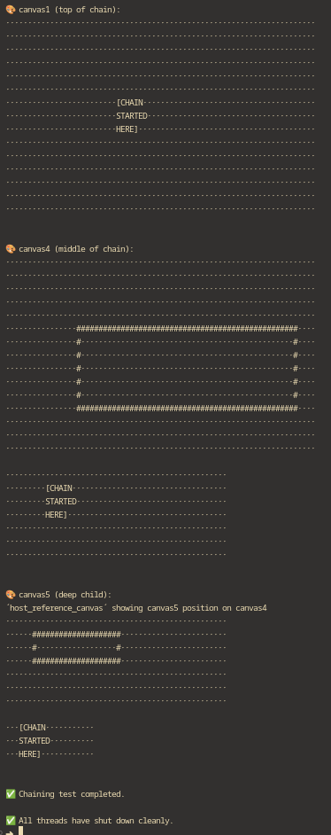

# 🎨 SigilEngine

## Foreword

This is a hobby project that can be used to build various ASCII based "projects"

The architechture is built in a way that should allow, easy expansion, and adding of new features, with minimal changes.

Chaining, and global registry allow for flexible queueing of commands, and rendering of different canvases.

Individual cells host their own metadata, this allows creating fun stuff like game of life, only by sending packets and reading the buffers, while the internals themselves stay untouched.

Some of the feartures like "visible" metadata, are in the code, but dont yet do anything.

Future plans (depending on motivation of the hobbyist :D):

- Sockets and servers for fully async usage and rendering
- Input handling
- Scrollable canvases (although this could already be done manually via origin, or content handling)
- Proper logging
- Styling options
- Handle visibility, and possibly "writable" metadata for individual cells

Feel free to contribute & fork

---

# Welcome to SigilEngine

A modular, threaded system for dynamic ASCII canvas rendering, chaining, and message forwarding.

This engine is built for fun, creativity, and hacking systems together — while giving you tight control over individual canvas states.

## 🌌 Core Components

- **CANVA_THREAD** - Active canvas thread with its own queue, state, and loop. All cells on the grid can host various metadata making the cells more than just a simple characters.
- **PACKET_CREATOR** - Helper to build ready-to-send command packets
- **ASCII_SCREEN** - Reusable tools for grid rendering and manipulation
- **SPACE** - Global registry of active canvases, dimensions, and queues

## 📦 Examples

```python
__init__()
# Sets up 5 canvas threads and a PACKET_CREATOR

test_loop()
# Randomly moves canvases, forwards messages, clears/redraws

chaining_test()
# Shows message forwarding between canvases

kill_test()
# Sends !kill, waits for cleanup, prints SPACE state

resize_and_fillvalue_test()
# Randomly resizes and updates fill characters

random_packet_generation()
# Builds random commands: resize, fill, move, write

run_random_test()
# Stress test: sends random packets, monitors queues

shutdown()
# Gracefully stops all threads, confirms shutdown
```

## ✉️ Command Packet System

### Structure

```python
{
  "command": {
    "cmd": "command_name",
    "args": {...}
  },
  "chart": [...],
  "metadata": [...]
}
```

**Example:**

```python
{
  "command": { "cmd": "write", "args": {} },
  "chart": [ (4,10), (4,11) ],
  "metadata": [ {"char": "@"}, {"char": "#"} ]
}
```

### 🔧 Supported Commands

|Command|Description|
|---|---|
|`write`|Local write|
|`auto_forward`|Local write + forward until no hosts left|
|`resize`|Change canvas size|
|`set_origin`|Reposition on host|
|`set_host`|Change host canvas|
|`set_fillvalue`|Set default fill character|
|`!kill`|Remove canvas, stop thread|
|`forward_to`|Local write + forward until target canvas|
|`clear`|Regenerate canvas using current state|

### 🔍 Command Details

**write**

- Writes locally using chart + metadata
- Engine stays passive; logic layer controls placement

**auto_forward**

- Writes locally, then forwards automatically to the next host
- Enables chaining small canvases into a final buffer

**resize**

- Updates canvas size, recreates buffer, resyncs host, and draws debug borders

**set_origin**

- Updates canvas origin on host, regenerates chart, refreshes host reference
- Does NOT auto-write canvas content to host.

**set_host**

- Sets a new host if it exists in SPACE, resyncs canvas with host dimensions

**set_fillvalue**

- Updates fill character
- Multi-character fills can break visual grid; use with care

**!kill**

- Removes canvas from SPACE, stops its thread loop

**forward_to**

- Writes locally using chart + metadata
- Forwards the same data up the host chain
- Stops forwarding once the specified target canvas is reached

**clear**

- Wipes canvas by regenerating it from current state

## 🌌 SPACE

The global registry that coordinates all canvas threads:

```python
SPACE
# Global dictionary storing CANVA_THREAD instances
# Tracks canvas ID, dimensions, queues, thread objects

SPACE_LOCK
# Global Lock for thread-safe access to SPACE
# Always wrap SPACE reads/writes in:
with SPACE_LOCK:
    # Your code here
```

## 🖥️ ASCII_SCREEN

Utility functions for ASCII canvas operations:

```python
clear_screen()
# Cross-platform terminal clear

create_canvas()
# Builds full canvas with metadata

create_ref_canvas()
# Lightweight debug/reference canvas

render()
# Converts canvas buffer to printable string

write_cell()
# Safely updates a single cell

zip_and_write()
# Bulk-write metadata across coordinates

box_borders()
# Draws visual borders around canvas regions

generate_wrapped_chart()
# Creates wrapped text coordinates

generate_coords()
# Generates coordinate grid for a region
```

## ⚙️ CANVA_THREAD

The **CANVA_THREAD** is the heart of the engine — an independent, threaded canvas instance that:

- Listens on its queue for command packets
- Manages its state: size, fill, position, visibility
- Communicates with other canvases by forwarding data
- Registers itself in the global SPACE registry

### 🎮 Core Methods

```python
run()
# Main loop: waits on queue, processes packets

parse_packet()
# Parses incoming packets, executes commands

clear_canvas()
# Resets local buffer with current state

check_host()
# Verifies if assigned host exists in SPACE

sync_host()
# Syncs local canvas with host dimensions
# Builds host_ref_canvas (debug overlay) + conversion chart

sync_to_space()
# Updates height, width, visibility in SPACE

kill()
# Marks self dead, removes from SPACE
```

### 🌊 Thread Life Cycle

1. Registers itself into SPACE
2. Builds its local canvas + optional host debug canvas
3. Enters a loop:
    - Waits for packets (`queue.get()`)
    - Processes commands
    - Forwards to host if needed
4. Exits cleanly when `alive = False` or on `!kill`

### 📡 Communication Flow

**Local → Host → Host's Host → … → Top Canvas**

With `auto_forward` or `forward_to`, CANVA_THREAD can pass its rendered data up the chain — all controlled with simple packet headers.

### 🔥 Debugging Tips

- Check `thread.is_alive()` to monitor health
- Print `queue.qsize()` to spot clogged threads
- Print `SPACE` (with lock!) to inspect canvas states
- Enable `host_ref_canvas` renders for placement debugging
- Use `time.sleep()` in test loops to slow things down


## Few images from the tests included



